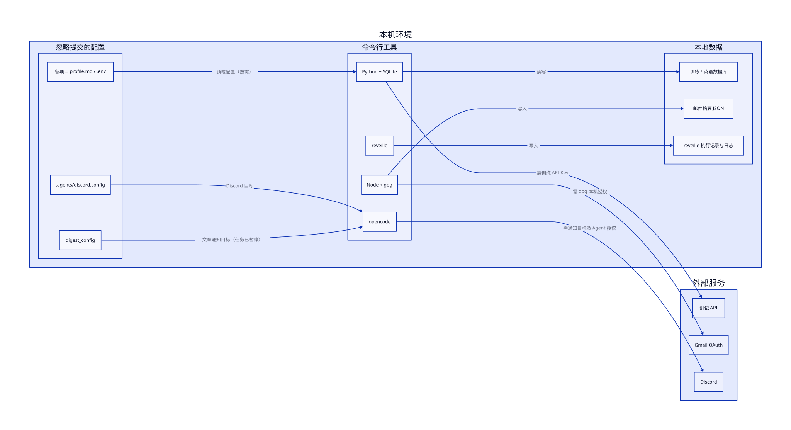
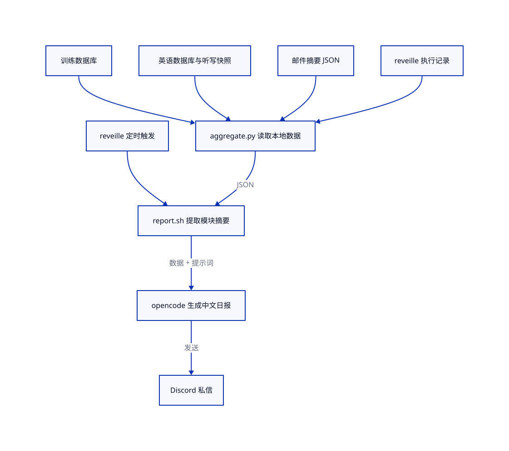
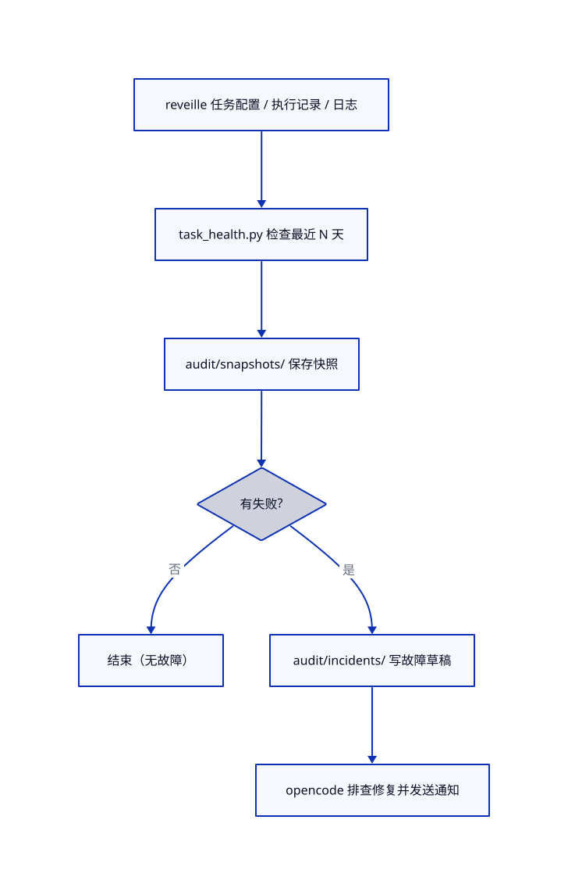

# Life Ops 本地项目文档

本目录记录仓库的**实现结构和操作工作流**，从仓库根目录阅读；不是部署到 GitHub Pages 的领域知识库。面向使用和维护本仓库的人。领域知识的编辑规范请看 `../docs/<领域>/knowledge/WORKFLOW.md`。

## 架构与流程图

- [LikeC4 系统边界及运营内部视图](../architecture/likec4/views.c4)：统一模型在 [model.c4](../architecture/likec4/model.c4)；适合查看长期存在的组件和依赖。
LikeC4 [系统边界及运营视图](../architecture/likec4/views.c4) 共用一个 [架构模型](../architecture/likec4/model.c4)；运行 `./architecture/scripts/serve` 后在本机 viewer 查看 `context` 和 `operations`。D2 图及其 [图源与渲染说明](../architecture/README.md) 如下；图只展示关键路径，领域知识维护和人工数据录入不在流程图中。

### 本机工具、配置与外部服务



[查看 D2 图源](../architecture/diagrams/source/runtime-dependencies.d2) · [单独打开 SVG](../architecture/diagrams/generated/runtime-dependencies.svg)

### 日报生成



[查看 D2 图源](../architecture/diagrams/source/daily-report.d2) · [单独打开 SVG](../architecture/diagrams/generated/daily-report.svg)

### 任务巡检



[查看 D2 图源](../architecture/diagrams/source/task-health.d2) · [单独打开 SVG](../architecture/diagrams/generated/task-health.svg)

### 外部依赖与配置边界

| 场景 | 仓库外依赖 | 配置/数据入口 | 缺失时影响 |
| --- | --- | --- | --- |
| 自动调度与巡检 | 本机 `reveille` | `~/.config/reveille/tasks/*.md`、`executions/*.json`；stderr 日志在 `~/.local/share/reveille/logs/` | 不会自动触发；巡检无执行记录或缺日志 |
| 训练同步 | 训记 API、Python | `projects/workout/.env.example` 列出 `XUNJI_BODY_API_KEY`、`XUNJI_DIET_API_KEY`、`XUNJI_FOOD_SEARCH_API_KEY`、`XUNJI_TRAIN_API_KEY`；训练数据在本地 `.agents/db/train.db` | 需要 API 的同步不可用，聚合报告可能无训练数据 |
| 邮件摘要 | Gmail、`gog`（OAuth）、Node、`opencode` | `gog` 的本机授权；`projects/gmail/tmp/emails.json` | 抓取或生成摘要失败；`email-summary.sh` 还固定引用本机 Node 路径，移机需检查 |
| 日报与故障通知 | `opencode`、Discord | 根目录 `.agents/discord.config.example` → 忽略提交的 `discord.config`（如 `DISCORD_DM_USER`）；agent 自身的 Discord 能力 | 不能向目标发送私信 |
| 文章日报（暂停） | 抓取源、`opencode`、Discord | `projects/article/.agents/sched/digest_config.example` → `digest_config`（`DISCORD_USER_ID`） | 启用调度前必须配置 |
| 英语学习 | Python、SQLite、本地听写快照 | `projects/english/.agents/db/english_learning.db`、`projects/english/tmp/daily-dictation/`；`.env.example` 提供 `DICTIONARY_API_KEY`、可选 `AI_API_KEY` 与学习目标变量 | 依赖相应能力的学习流程不可用；缺本地数据时聚合结果不完整 |
| 理财学习 | Python、SQLite | `projects/finance/.env.example` 中的 `DB_PATH` 和按需启用的行情 API key | 影响相应分析功能；理财**不进入当前聚合日报** |
| 知识库网站 | 静态 Pages / Docsify | `docs/` 中的 HTML、Markdown 和导航 | 网站不可访问不影响本地运营脚本 |

配置模板是可用变量的索引，**不是所有脚本都读取全部变量**；使用具体功能前以对应脚本的读取方式为准。密钥、OAuth 凭据、数据库及邮件内容始终只保存在本机，不写进图或文档。当前 shell 脚本包含 macOS `sed -i ''` 和固定 Node 路径，不能假定跨平台可直接运行。

### 推荐阅读路线

1. 新读者：先看 LikeC4 的 `context` 视图，再看 `operations` 视图理解领域数据如何流向运营层。
2. 要运行日报：看上方日报图 → 依赖表 → 第 3 节上手 → 第 4 节更改日报。
3. 要排查失败：看上方巡检图 → `audit/README.md` → 本机执行记录和日志。

## 1. 项目地图

Life Ops 是个人运营 monorepo：领域项目提供数据采集、学习与自动化；共享工具负责复用；运营层跨领域聚合和巡检。

| 路径 | 职责 | 入口 |
| --- | --- | --- |
| `projects/workout/` | 训练记录、计划查询、训练预告和总结 | `.agents/db/`、`.agents/sched/` |
| `projects/english/` | 英语学习、每日听写及本地 dashboard | `.agents/workflows/daily-dictation/`、`dashboard/` |
| `projects/finance/` | 理财学习与分析脚本 | `scripts/` |
| `projects/gmail/` | 邮件分类、抓取和摘要 | `scripts/`、`sched/email-summary.sh` |
| `projects/article/` | 每日文章摘要（当前暂停调度） | `.agents/sched/daily_digest.sh` |
| `shared/` | 学习记录 CLI、数据库初始化及知识库校验 | `study_log/`、`db/`、`tools/` |
| `ops/` | 聚合日报、定时任务健康检查与审计查询 | `aggregate.py`、`report.sh`、`task_health.py`、`audit.py` |
| `audit/` | 故障记录和变更日志；生成的快照不入库 | `README.md`、`incidents/`、`CHANGELOG.md` |
| `docs/` | GitHub Pages 三个领域的知识库（网站内容） | `index.html`、`{workout,english,finance}/` |
| `.agents/skills/` | Agent 的领域技能和共享指引 | 各技能 Markdown、`_shared/` |
| `.github/workflows/ci.yml` | 推送和 PR 的语法检查 | CI 工作流 |
| `openspec/changes/` | 提案草稿 | 各变更的 `proposal.md` |

`projects/<领域>/.agents/profile.example.md` 是可复制的个人画像模板；真实 `profile.md` 和数据库属于本地个人数据，不应写进知识库或提交。各领域的 README 可提供更细的使用背景，但迁移后的路径应以仓库实际文件为准。

## 2. 运行与数据流

上方两张流程图分别覆盖聚合日报和巡检。领域脚本由本机 reveille 调度；日报读取训练、英语、邮件的本地数据及任务执行记录，巡检读取任务配置和执行记录。理财学习和当前暂停的文章日报不进入聚合日报。

根目录 `README.md` 列出当前任务名称和调度时间；实际启用状态与调度配置应在本机 `reveille` 核对。文章日报在根 README 中标为暂停。`ops/report.sh` 和 `ops/task_health.sh` 会调用 agent 和外部服务，后者在故障处理流程中还可能修改代码、提交及推送：**不要把它们当作只读检查命令**。

## 3. 本地上手

在仓库根目录运行；需 Python 3、Node.js、Bash，任务入口可选 `just` 或 `make`。完整自动化还依赖本机 `reveille`、`opencode`、Discord 配置及各领域服务（例如 Gmail 的 `gog`）；仅阅读知识库或执行语法检查不需要这些服务。

```bash
# 检查代码语法（不会发送消息）
just check
# 或 make check

# 查询已有审计记录（不触发巡检）
just audit
# 或 python3 ops/audit.py list

# 初始化一份本地英语学习数据库（先自行创建目标目录）
python3 shared/db/init_db.py \
  --db projects/english/.agents/db/english_learning.db \
  --schema shared/db/schemas/english.sql

# 查询学习记录；先初始化数据库，再用 CLI 的 --help 查看子命令
python3 shared/study_log/study-log.py --db projects/english/.agents/db/english_learning.db --help
```

自动化相关配置见 `.agents/discord.config.example`、各领域的 `.env.example` 和 `profile.example.md`；复制到对应位置后填写自己的信息，勿把密钥或个人画像提交。`just report` 会发送日报；`just health` 会运行巡检并可能触发故障处理、提交/推送，运行前确认本地授权和预期副作用。

## 4. 常见维护工作流

### 更新领域知识

1. 在 `docs/<领域>/knowledge/` 收集资料，按该领域 `WORKFLOW.md` 整理来源与内容；个人数据留在项目本地画像或数据库。
2. 更新 `快速导航.md` 和必要的 `来源文献.md`；如新增页面，还要检查对应 `docs/<领域>/_sidebar.md` 的导航。
3. 运行 `shared/tools/check-frontmatter.sh docs/<领域>/knowledge` 和 `shared/tools/check-sidebar-links.sh docs/<领域>`。提交时 `lefthook.yml` 的 pre-commit 也运行三个领域的这两类校验；CI 还会执行 Python、Shell、Node 的语法检查。

### 维护定时任务

1. 找到根 `README.md` 中对应任务和 `projects/*/.agents/sched/`、`projects/english/.agents/workflows/` 或 `ops/` 下的入口。
2. 先查看本机 reveille 的任务配置、执行记录与日志，再定位脚本；不要根据没有数据的日报推断任务失败。
3. 修改后运行 `just check`，必要时在已配置的环境中手动执行对应脚本或 `reveille run <任务 ID>`；这些命令可能发送通知或访问外部服务。
4. 故障记录放在 `audit/incidents/`；具体排查与审计规范见 `audit/README.md`。`audit/snapshots/` 是生成产物，被 `.gitignore` 忽略。

### 更改跨项目日报

从 `ops/aggregate.py` 的数据读取和 JSON 输出入手，再检查 `ops/report.sh` 如何转换、传给 agent；调整上游字段时一起核对下游消费者。先做不会发送消息的本地数据检查，确认隐私和收件目标后才运行 `just report`。

## 5. 文档边界

- 本目录说明**仓库如何工作**；`docs/` 说明训练、英语、理财的**领域知识**，并作为网站内容发布。
- 命令约定以根目录 `justfile`、`Makefile` 为准；领域特有前置条件查 `projects/<领域>/README.md`。
- 本地配置、令牌、生成的数据库与运行日志不应进入此文档。修改目录或工作流时同步更新这里的入口说明。
